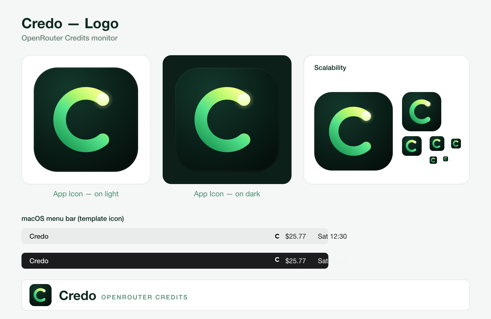

# 🔑 Credo


A professional Flutter application for managing OpenRouter API keys and checking account credits.

## 📌 Project Overview

Credo is a Flutter-based desktop and mobile app that keeps an eye on your OpenRouter
account. It stores your API keys in the platform's native secure storage, reads your
credit balance and usage from the OpenRouter REST API, and presents everything in a
clean Material 3 interface — with handy extras like a low-balance alert, a burn-rate
estimate, and a one-tap JSON export.

## ✨ Features

Here is what the app can do, in plain terms:

- 🔐 **Secure API Keys** — Keys are stored in the platform's native Keychain/Keystore
  via `flutter_secure_storage`; they are never written to disk in plain text.
- 💳 **Credit Monitoring** — See your OpenRouter account balance and usage in real time.
- 🔑 **Two Key Types** — Works with both *Inference* keys (per-key limits & usage) and
  *Management* keys (account-wide balance), switchable from Settings.
- 📊 **Usage Breakdown** — Today, this week, this month, and total usage are shown as
  cards, each with a progress bar against the key's limit.
- 📈 **Burn Rate Estimate** — A "≈ N days left at current rate" hint, computed from your
  daily usage, so you know when your credits will run out.
- 🔔 **Low-Balance Alert** — A coloured banner appears when your remaining credits fall
  below 20% (orange) or 5% (red).
- 🎨 **Smart Balance Colour** — The main balance turns green → orange → red as it runs
  low, so the status is obvious at a glance.
- 🌗 **Dark / Light / System Theme** — Pick a theme in Settings; the choice is
  remembered across restarts.
- 🕐 **Friendly "Time Ago"** — The last-updated line shows a readable "2 min ago" style
  label instead of a raw clock time.
- 🔄 **Manual Refresh** — Refresh with the toolbar button or the pull-to-refresh gesture.
- 📋 **Copy & Export** — Tap the balance to copy it, or export a JSON snapshot of your
  credits and usage from Settings → Data.
- 🔒 **Safe Logout** — Deleting your stored key asks for confirmation first.
- 🎨 **Modern, Adaptive UI** — Material 3 design with responsive spacing that scales
  across desktop and mobile.

## 🎨 Screenshots

### Home Screen — Credits & Usage


> The app provides a clean, intuitive interface for managing your OpenRouter API keys and monitoring account credits in real-time.

## 🛠️ Tech Stack

- **Flutter & Dart** (3.13.2+)
- **State Management**: [Provider](https://pub.dev/packages/provider) v6.1.1 — a single
  `ChangeNotifier` (`AppProvider`) drives the whole app
- **Secure Storage**: [`flutter_secure_storage`](https://pub.dev/packages/flutter_secure_storage)
  — platform Keychain/Keystore for the API key and the theme choice
- **Networking**: [`http`](https://pub.dev/packages/http) — REST calls to OpenRouter
  (`/api/v1/key` and `/api/v1/credits`)
- **Links**: [`url_launcher`](https://pub.dev/packages/url_launcher) — opens the
  OpenRouter keys page in a browser
- **Formatting**: [`intl`](https://pub.dev/packages/intl) — currency formatting
- **App Icons**: [`flutter_launcher_icons`](https://pub.dev/packages/flutter_launcher_icons)
  — generates the platform launcher icons

## 🚀 How to Run

### Prerequisites

- Flutter SDK (3.13.2+)
- Dart 3.x
- Platform-specific requirements:
  - **Android**: Android SDK 21+
  - **iOS**: Xcode 14+
  - **macOS**: Xcode 14+
  - **Web**: Any modern browser
  - **Windows**: Windows 10+ (⚠️ Untested)
  - **Linux**: (⚠️ Untested)

### Installation

```bash
# Get dependencies
flutter pub get

# Run the app
flutter run
```

### Build for Platforms

```bash
# Android
flutter build apk

# iOS
flutter build ios

# macOS
flutter build macos

# Windows
flutter build windows

# Linux
flutter build linux

# Web
flutter build web
```

## 📂 Project Structure

```
lib/
├── main.dart                       # Entry point: providers + light/dark theme
├── models/
│   ├── credits_info.dart           # Account credit totals (management key)
│   ├── key_info.dart               # Per-key limits & usage (inference key)
│   └── key_type.dart               # Inference / Management key enum
├── providers/
│   └── app_provider.dart           # Single ChangeNotifier holding all app state
├── screens/
│   ├── home_screen.dart            # Balance, usage cards, alerts, refresh
│   ├── key_setup_screen.dart       # First-run API key entry & connection test
│   └── settings_screen.dart        # Key type, theme, JSON export, logout
├── services/
│   ├── openrouter_service.dart     # OpenRouter REST API calls
│   └── secure_storage_service.dart # Keychain/Keystore read & write
└── utils/
    ├── api_key_mask.dart           # Masks the API key for display
    ├── export_helper.dart          # Builds the JSON export snapshot
    └── url_helper.dart             # Launches external OpenRouter links
assets/
├── images/                         # App logo & icon (SVG + PNG variants)
└── icons/                          # Platform icons used in this README
```

## 📱 Supported Platforms

| Platform | Status | Notes |
|---|:---:|---|
|  | ✅ Tested | Working on Android phones & tablets |
|  | ✅ Tested | Working on iPhone & iPad |
|  | ✅ Tested | Chrome, Firefox, Safari compatible |
|  | ✅ Tested | Working on Apple Silicon |
|  | ❌ Not tested | Build available |
|  | ❌ Not tested | Build available |

> Android, iOS, Web, and macOS tested. Windows & Linux builds available but untested.

## 📝 License

MIT License. See [LICENSE](LICENSE) for details.

**Copyright © 2026 moradzadeh67**

This project is open-source and free to use, modify, and distribute under the MIT License terms.