# Credo

Credo is a lightweight, open-source Flutter app for managing OpenRouter API keys and monitoring your credit balance — securely and in real time. Built with Material Design 3 and platform-native secure storage. Available on Android, iOS, macOS, and Web.

[](https://github.com/moradzadeh67/credo/releases/latest)
[](https://opensource.org/licenses/MIT)
[]()

### 📥 [Download Latest APK](https://github.com/moradzadeh67/credo/releases/latest)

## 💡 Why I Built This

As a developer frequently building with LLMs via OpenRouter, I found myself constantly navigating to the web dashboard just to check my remaining credits and monitor usage limits. I wanted a fast, lightweight, and secure tool that lived on my desktop and mobile devices without requiring third-party servers or exposing my API keys. Since I couldn't find a focused, privacy-first utility that fit my workflow, I decided to build Credo.

## 📸 Screenshots

### macOS
| Home | Dark Mode | Settings |
|:---:|:---:|:---:|
| 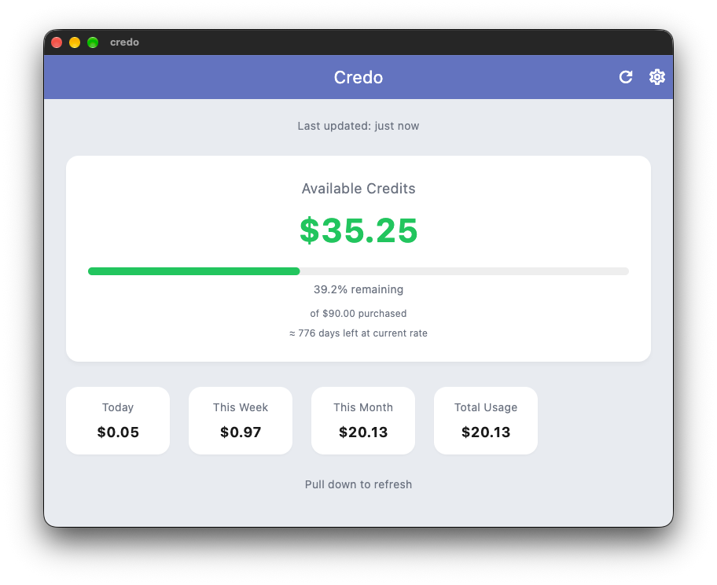 | 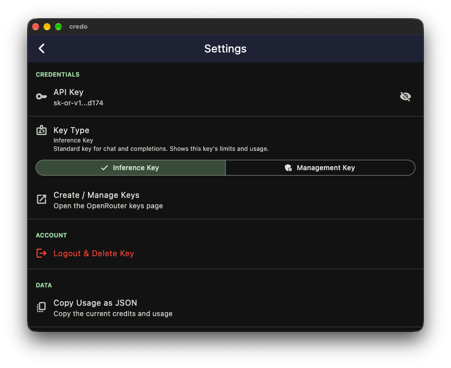 | 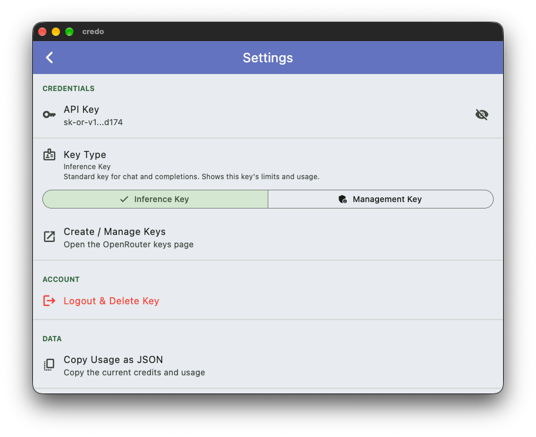 |

### Android
| Home | Dark Mode | Settings |
|:---:|:---:|:---:|
| 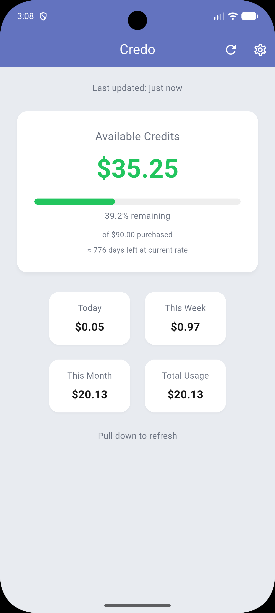 | 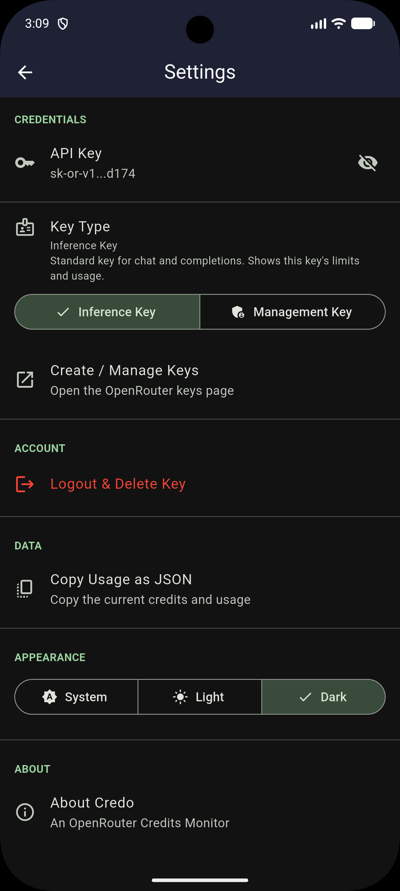 | 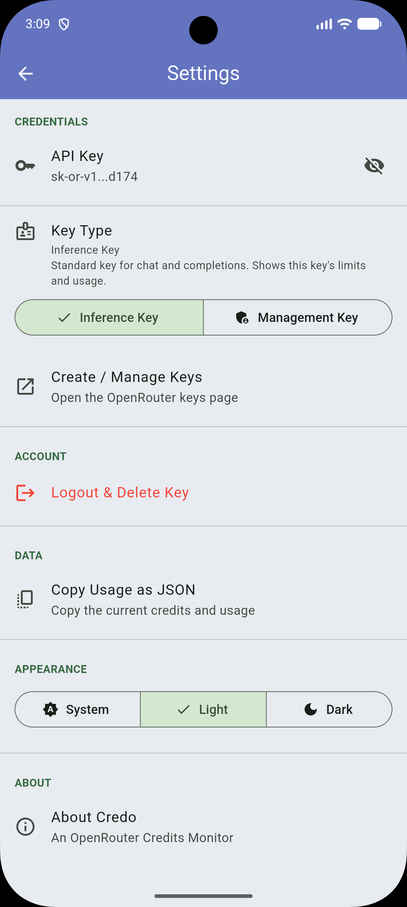 |

### iOS
| Home | Dark Mode | Settings |
|:---:|:---:|:---:|
| 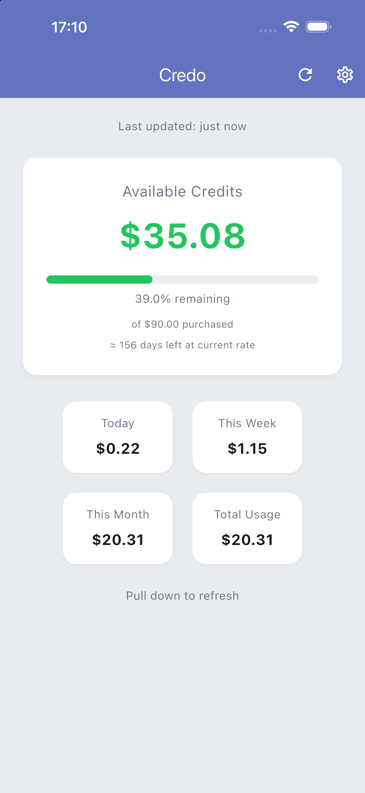 | 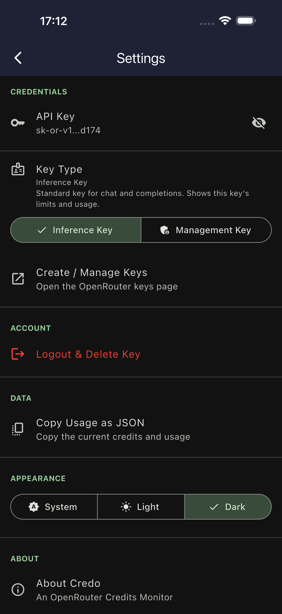 | 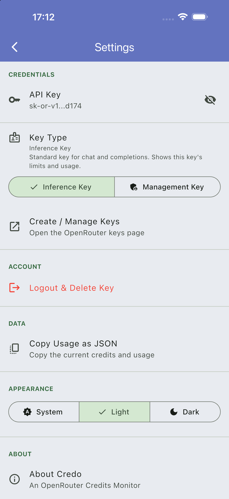 |

### Web
| Home | Dark Mode | Settings |
|:---:|:---:|:---:|
| 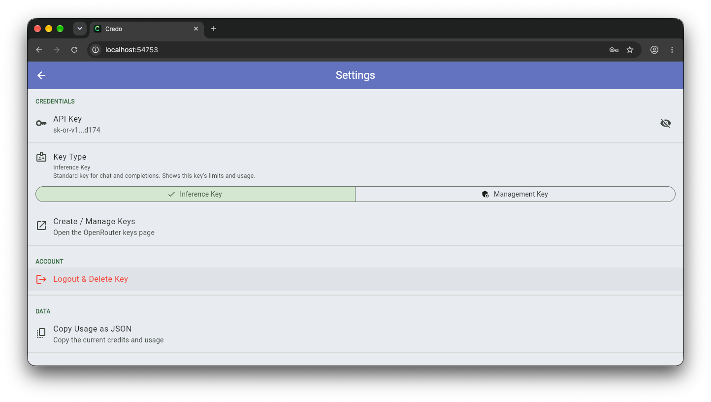 | 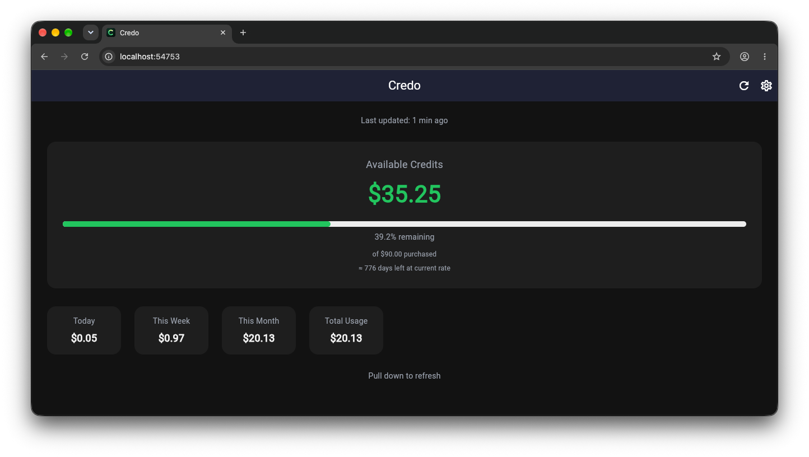 | 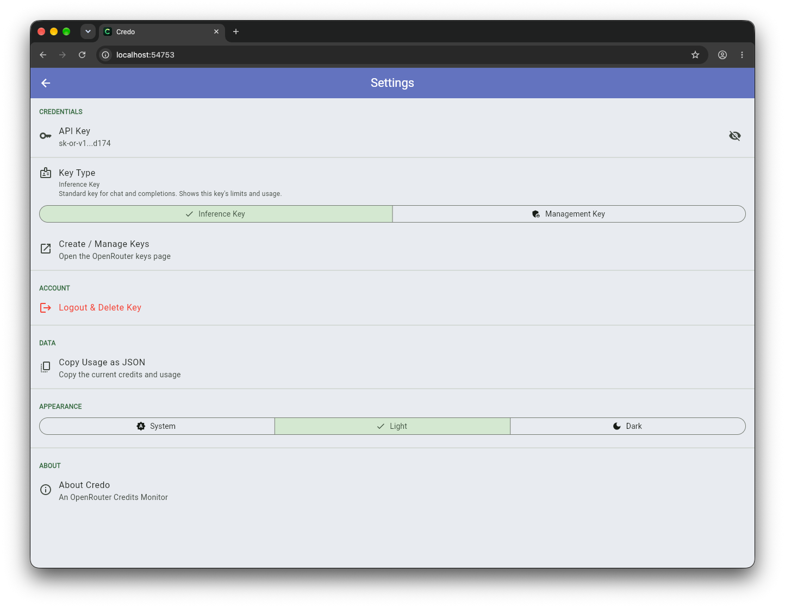 |

## ✨ Features

- 🔐 **Secure API Key Storage** — Keys are encrypted in system-native storage (Keychain on iOS/macOS, Keystore on Android).
- 💳 **Real-Time Credit Monitoring** — Instant overview of remaining credits and total account balance.
- 📊 **Usage Tracking** — Detailed breakdowns for daily, weekly, monthly, and total API usage.
- 📈 **Burn Rate Estimation** — Smart calculation showing estimated days remaining based on current usage velocity.
- 🔔 **Low-Balance Alerts** — Visual warning banners when credit drops below custom threshold percentages (20% and 5%).
- 🌗 **Dark / Light / System Theme** — Full Material 3 theming support that respects system preferences or user choice.
- 🎨 **Centralized Theme System** — All colors, elevation, and typography defined in a single `AppTheme` class for consistent UI across every screen and platform.
- 📋 **Export to JSON** — One-tap backup and export of credit snapshots and key metadata.
- 📱 **Multi-Platform** — Native responsive support for Android, iOS, macOS, and Web.

## 🗺️ Roadmap

- [x] Secure API key storage (Keychain / Keystore)
- [x] Credit balance & usage monitoring
- [x] Dark / Light / System theme modes
- [x] Centralized theme system (`AppTheme`)
- [x] Low-balance warning alerts
- [x] Burn-rate estimation
- [x] JSON data export
- [ ] Multiple API key profiles support
- [ ] Historical usage graphs & analytics
- [ ] Desktop system tray / menu bar quick indicator
- [ ] Push notifications for critical credit thresholds

## 🛠️ Technical Decisions

Every technical choice in Credo was made with simplicity, maintainability, and security in mind:

- **Provider (State Management)**: Chosen over BLoC or Riverpod because Credo is a focused, single-purpose application. Provider provides a lightweight, idiomatic `ChangeNotifier` solution without introducing unnecessary boilerplate or complex event streams.
- **`flutter_secure_storage`**: API keys are high-value credentials. Storing them in standard `SharedPreferences` or local JSON files is insecure. `flutter_secure_storage` delegates storage directly to platform-native secure vaults (iOS/macOS Keychain, Android Keystore).
- **`http` over `dio`**: Credo only communicates with two simple REST endpoints (`/api/v1/key` and `/api/v1/credits`). Using standard `http` keeps the dependency footprint minimal without needing Dio's complex interceptor architecture.
- **Material Design 3**: Provides modern UI components, adaptive layout scaling, and dynamic dark/light color palette integration out of the box.
- **Centralized Theme (`AppTheme`)**: All colors, elevation values, and text styles are defined in a single `lib/theme/app_theme.dart` file. This ensures visual consistency across every screen and platform, and makes future theme adjustments a one-file change.
- **Directory Structure (`models/` - `services/` - `screens/` - `providers/` - `theme/` - `utils/`)**: Enforces clean separation of concerns. Data models, network/storage services, UI screens, theme constants, and state logic remain strictly decoupled for readability and testability.

## 🏗️ Architecture

Credo follows a clean layered architecture using the Provider pattern.

### Project Structure

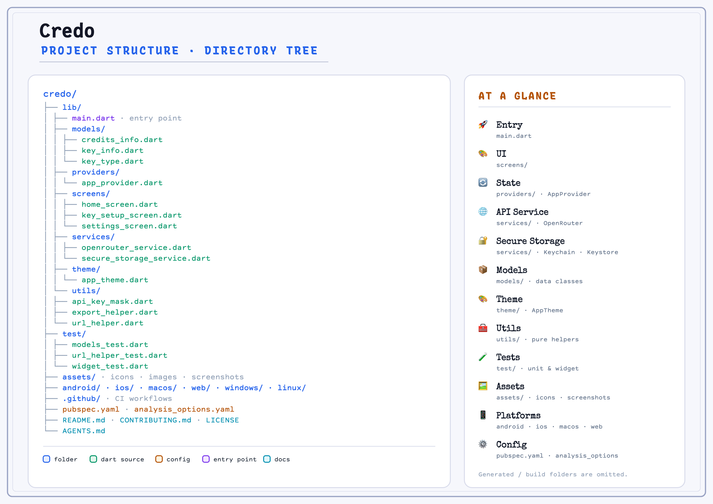

### Architecture Layers

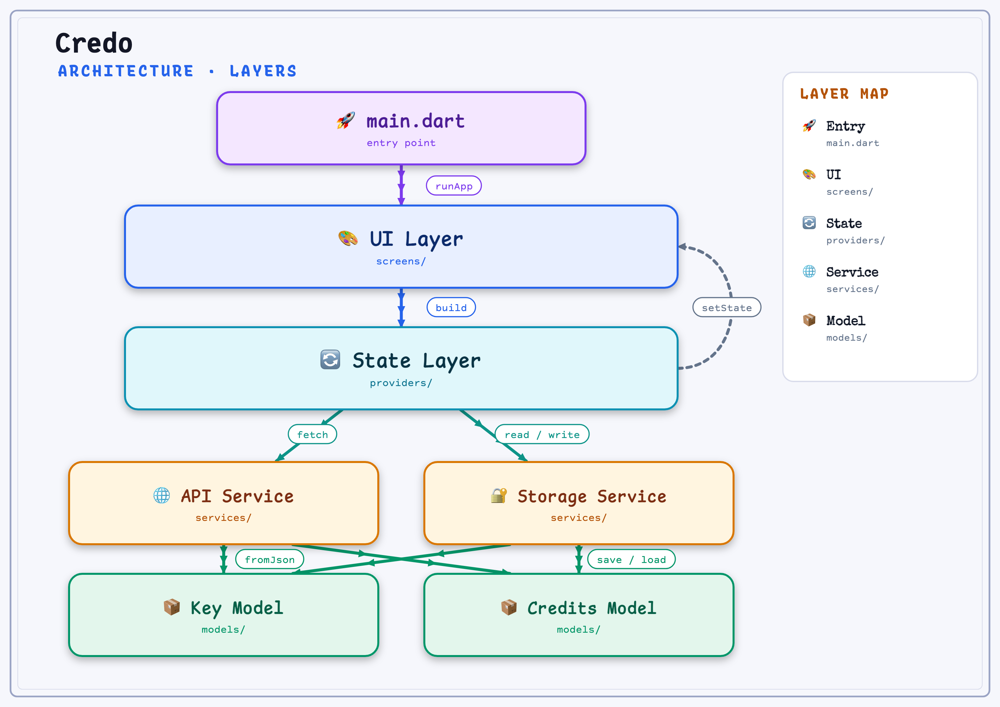

### Data Flow

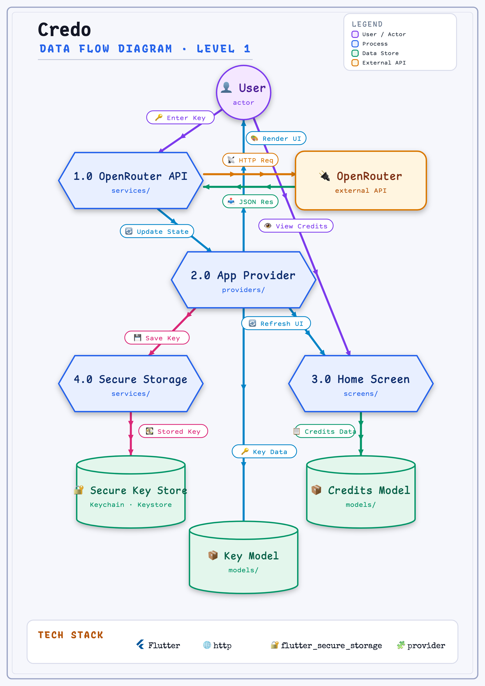

### Layer Overview

```
lib/
├── models/     → Data models (CreditsInfo, KeyInfo, KeyType)
├── providers/  → State management & business logic (AppProvider)
├── screens/    → UI presentation layer (Home, KeySetup, Settings)
├── services/   → External APIs & native storage (OpenRouter, SecureStorage)
├── theme/      → Centralized theme (AppTheme — colors, elevation, typography)
└── utils/      → Pure helper functions (mask, url, export)
```

### Data Flow Summary

1. **Entry** — `main.dart` calls `runApp()`
2. **UI Layer** — `screens/` builds widgets
3. **State Layer** — `providers/` manages app state (Provider pattern)
4. **Services** — `services/` handles API calls and secure storage
5. **Models** — `models/` represents typed data
6. **Update Cycle** — State changes trigger `notifyListeners()` → UI rebuilds

## 📱 Platform Support

| Platform | Status | Notes |
|---|:---:|---|
| 🤖 Android | ✅ Tested | Working on phones & tablets |
| 🍎 iOS | ✅ Tested | Built with Xcode 14+ |
| 🌐 Web | ✅ Tested | Chrome, Firefox, Safari compatible |
| 🖥️ macOS | ✅ Tested | Apple Silicon |
| 🪟 Windows | ⚠️ Untested | Build available |
| 🐧 Linux | ⚠️ Untested | Build available |

## 🚀 Installation & Running

### 🔑 Getting Your API Key

1. **Sign up / Log in**: Go to [OpenRouter](https://openrouter.ai/).
2. **Navigate to API Keys**: Access your account's [API Keys settings](https://openrouter.ai/keys).
3. **Create a Key**: Generate a new API key (choose either an *Inference* or *Management* key).
4. **Copy the Key**: Copy the generated key string and paste it into Credo when prompted during setup.

### Prerequisites
- [Flutter SDK](https://docs.flutter.dev/get-started/install) (v3.13+)
- Dart SDK (v3.x)

### Getting Started

1. **Clone the repository**:
   ```bash
   git clone https://github.com/moradzadeh67/credo.git
   cd credo
   ```

2. **Install dependencies**:
   ```bash
   flutter pub get
   ```

3. **Run the application**:
   ```bash
   # Run on connected device or default desktop
   flutter run
   ```

### Building

```bash
# Build Android APK
flutter build apk --release

# Build macOS Desktop app
flutter build macos --release

# Build Web distribution
flutter build web --release
```

## 💻 Development Environment

This project is actively developed and tested using:
- **OS**: macOS (Apple Silicon)
- **IDE**: VS Code / Android Studio
- **iOS/macOS Build Toolchain**: Xcode 14+
- **Flutter Framework**: Flutter 3.13+

## 🤝 Contributing

Contributions are welcome! Please read [CONTRIBUTING.md](CONTRIBUTING.md) for guidelines on how to get started.

## 📄 License

This project is licensed under the MIT License — see the [LICENSE](LICENSE) file for details.

Copyright © 2026 moradzadeh67